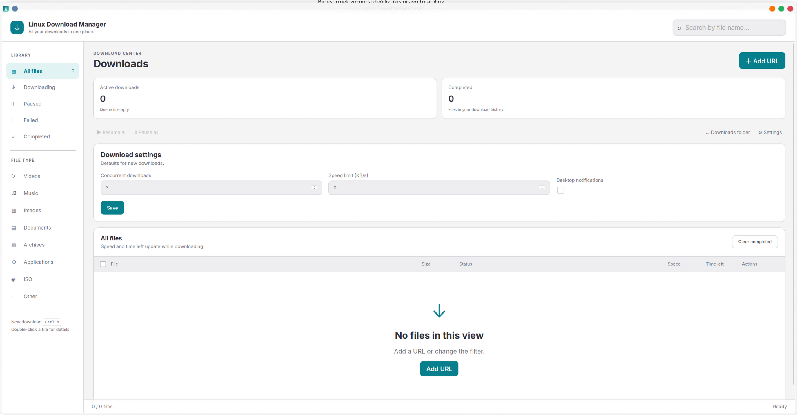

<p align="center">
  
</p>

<h1 align="center">Linux Download Manager</h1>

<p align="center">
  A download manager for Linux with browser integration, video downloads,<br>
  live progress and an automatically organized download library.
</p>

<p align="center">
  <a href="#installation">Installation</a> ·
  <a href="#browser-setup">Browser setup</a> ·
  <a href="#where-your-downloads-go">Download folders</a> ·
  <a href="#updating">Updating</a> ·
  <a href="#troubleshooting">Troubleshooting</a>
</p>



## What you can do

- Download files by pasting a URL or sending a download from your browser.
- Capture videos from YouTube, Twitter/X and Reddit using the browser integration. Other supported pages use yt-dlp; availability depends on the website and access requirements.
- See progress, transfer speed and estimated time remaining for each download.
- Filter by status or file type, search by name, and pause or resume eligible selections together.
- Open a file's folder, inspect download details, or clear history without deleting downloaded files.
- Configure concurrent downloads, desktop notifications and a default speed limit. New downloads also support scheduling and optional SHA-256 verification.
- Keep the app in the system tray while downloads run.

Resume support depends on the server and download method. Video and audio may be downloaded separately and combined with FFmpeg.

## Installation

### Install from source

The installer supports dependency setup through `pacman`, `apt` or `dnf` on Arch/CachyOS, Debian/Ubuntu and Fedora. It checks the Rust toolchain and required GTK3/WebKitGTK 4.1 libraries, builds the application, and installs it for your user.

```bash
git clone https://github.com/ekremx25/linux-download-manager.git
cd linux-download-manager
./install.sh
```

Run the installer **as your normal user**, without `sudo`. It requests `sudo` when system dependencies need installing. Video downloads require yt-dlp and FFmpeg; the installer also handles the JavaScript runtime used by yt-dlp.

After installation, open **Linux Download Manager** from your applications menu, or run:

```bash
~/.local/bin/linux-download-manager
```

Complete the browser setup below to enable download buttons on video pages.

### Install from a prepared package

If you have a `LinuxDownloadManager-<version>-linux-x86_64.tar.gz` installer archive:

1. Extract it to a folder.
2. Open **Install.desktop** and trust the launcher if your desktop asks.
3. Alternatively, open a terminal in the extracted folder and run:

   ```bash
   bash ./install.sh --prebuilt
   ```

The prebuilt package does not require Rust. It still needs compatible GTK3, WebKitGTK 4.1 and system libraries. A binary built with a newer glibc may not run on older distributions; use the source installation in that case.

To create this archive from the repository:

```bash
./scripts/build-installer.sh
```

The archive and its SHA-256 checksum are written to `dist/`. Building a package locally does not publish a GitHub release.

## Browser setup

The extension supports Chromium-based browsers such as Chrome, Chromium, Brave, Edge and Vivaldi.

1. Open your browser's **Extensions** page, for example `chrome://extensions` or `edge://extensions`.
2. Turn on **Developer mode**.
3. Select **Load unpacked**.
4. Choose this folder:

   ```text
   ~/Documents/Linux Download Manager Extension/
   ```

5. Open or refresh the video page and use its **LDM** download button.

Keep that extension folder in place: the browser loads it from there. After an update, reload the extension from the Extensions page and refresh existing video tabs.

## Where your downloads go

**The application creates an `LDM` folder inside your system's Downloads directory when it starts.** Files are placed into subfolders according to their file extension.

With the usual Linux download directory, the library looks like this:

```text
~/Downloads/LDM/
├── Videos/          # MP4, MKV, WebM, MOV…
├── Music/           # MP3, FLAC, WAV, AAC…
├── Images/          # JPG, PNG, WebP, SVG…
├── Documents/       # PDF, TXT, office documents…
├── Applications/    # AppImage, DEB, RPM, APK…
├── Archives/        # ZIP, RAR, 7Z, TAR…
├── ISO/             # ISO and IMG disk images
└── Other/           # Unrecognized file types
```

For example, a video named `example.mp4` is normally saved to:

```text
~/Downloads/LDM/Videos/example.mp4
```

The app respects `XDG_DOWNLOAD_DIR` in `~/.config/user-dirs.dirs`, so the base directory may have a different name or location on your system. If no valid setting is found, it uses `~/Downloads`.

**Choosing a custom Save folder changes the base directory.** The app still creates `LDM/<category>` inside it. For example, choosing `/mnt/media` saves videos under `/mnt/media/LDM/Videos/`. Select the base folder, rather than an existing `LDM/Videos` subfolder, to avoid nested library folders.

Use **Show in folder** on a download to find its exact location. Sidebar categories filter your download history; they do not move existing files. **Clear completed** removes history entries only, leaving the downloaded files on disk.

## Everyday use

1. Click **Add URL**, paste a link, and optionally choose a Save folder or file name.
2. Click **Start download**. The app checks the link automatically; **Check link** is also available separately.
3. Watch **Speed** and **Time left** in the download row. Double-click the row for details.
4. Select several files to pause or resume them together. Use **Settings** to adjust concurrency, the default speed limit or notifications.

The default concurrency is **3 downloads**, the default speed limit is **unlimited**, and desktop notifications are enabled by default. Closing the window hides it to the tray; it does not quit the application.

### Progress and CPU usage

Speed and ETA refer to the current transfer. For video downloads, extraction, separate audio/video transfers and final merging are different stages; the remaining-time value is not a promise of total completion time. Unknown sizes or durations display a dash.

Progress notifications and database snapshots are limited to once per second. Hidden app windows avoid live repainting, and the extension skips background-tab scans. These measures reduce unnecessary work without imposing a transfer speed cap. Brief CPU spikes can still occur when yt-dlp starts, extracts video information, or FFmpeg combines streams.

## Updating

From a clean source checkout with a configured tracking branch:

```bash
cd linux-download-manager
./install.sh --update
```

The updater creates a backup Git tag, fetches the tracking branch, and accepts only a fast-forward update. It stops if you have local changes or the branches have diverged. It does not discard changes or force-push.

To reinstall your current local source without fetching:

```bash
./install.sh
```

For a prepared package, extract the newer archive and run its installer again. Existing application and extension files are backed up before replacement. Restart the app after active downloads finish, then reload the extension and refresh video tabs.

Useful installer options:

| Option | Purpose |
| --- | --- |
| `--check` | Inspect the installation plan without changing files. |
| `--no-deps` | Skip dependency installation and tool downloads. |
| `--skip-build` | Install binaries already present in `target/release/`. |
| `--prebuilt` | Install binaries included in a prepared installer package. |

## Installed files and removal

Default locations:

| Item | Location |
| --- | --- |
| Application | `~/.local/bin/linux-download-manager` |
| App data and download history | `~/.local/share/linux-download-manager-custom/` |
| Installation backups | `~/.local/share/linux-download-manager-custom/backups/` |
| Browser extension | `~/Documents/Linux Download Manager Extension/` |
| Download library | Your system Downloads directory, under `LDM/` |

Application data follows `XDG_DATA_HOME` when set. Downloaded files and app data are separate.

To uninstall from the repository or an extracted installer package:

```bash
./uninstall.sh
```

A copy of the uninstaller is also installed in the application data directory. Uninstallation preserves downloaded files, download history, installation backups and shared yt-dlp settings. Remove the unloaded extension entry from your browser's Extensions page afterward.

## Troubleshooting

| Problem | What to check |
| --- | --- |
| Cannot find a downloaded video | Use **Show in folder**, or check your Downloads directory under `LDM/Videos/`. |
| No LDM button or browser connection | Confirm the unpacked extension is loaded, reload it, and refresh the video page. Play the video so its stream can be detected. |
| A video download fails | Inspect the error in the download row or Details window. Verify yt-dlp and FFmpeg are available; website changes and access restrictions can affect downloads. |
| Speed or ETA is a dash | The transfer may not have started, or its size/rate may be unknown. Extraction and merging may not have a meaningful ETA. |
| The prebuilt app reports missing libraries | Use the source installer to build against your distribution's libraries. |
| An update stops on local changes | Commit or back up your edits before updating. The updater intentionally leaves them intact. |
| Changes do not appear after installation | Fully quit and reopen the app; reload the browser extension and refresh existing tabs. |

## Development

Built with Rust, Tauri 2, SQLite, reqwest and plain HTML/CSS/JavaScript. The Chromium extension uses Manifest V3; yt-dlp and FFmpeg handle supported video workflows.

```bash
# Build both the application and native browser bridge
CARGO_BUILD_JOBS=1 cargo build --release --locked --bins

# Backend and regression tests
cargo test --workspace
node scripts/test-progress-ui.cjs
node scripts/test-embedded-player.cjs
python3 scripts/test-installer.py

# Optional: requires installed yt-dlp; uses a localhost fixture
cargo test --workspace real_ytdlp_reports_live_speed_and_eta -- --ignored
```

| Directory | Contents |
| --- | --- |
| `src-tauri/src/` | Application, download engine, category routing and storage |
| `ui/` | Main window, Add URL and download details |
| `browser/chromium/` | Browser extension and media capture |
| `scripts/` | Installer packaging and regression checks |
| `docs/images/` | README screenshot |

Built with [Tauri](https://tauri.app/), [yt-dlp](https://github.com/yt-dlp/yt-dlp) and [FFmpeg](https://ffmpeg.org/).
